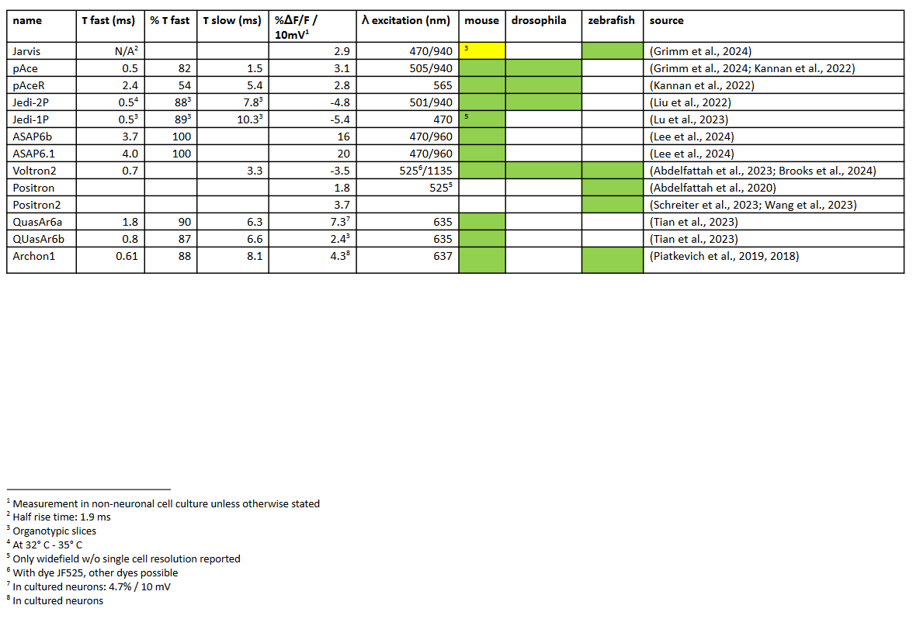

## voltage sensor comparison

Comparison of current state of the art genetically encoded voltage sensors

Soure table here: https://docs.google.com/document/d/1NZGYYdjyOe-s_cvU2B_BVHxEU2cKidR-kkZ8eBgwd3c/edit?usp=sharing

Abdelfattah, A.S., Valenti, R., Zheng, J., Wong, A., Podgorski, K., Koyama, M., Kim, D.S., Schreiter, E.R., 2020. A general approach to engineer positive-going eFRET voltage
indicators. Nat. Commun. 11, 3444. https://doi.org/10.1038/s41467-020-17322-1
Abdelfattah, A.S., Zheng, J., Singh, A., Huang, Y.-C., Reep, D., Tsegaye, G., Tsang, A., Arthur, B.J., Rehorova, M., Olson, C.V.L., Shuai, Y., Zhang, L., Fu, T.-M., Milkie, D.E., Moya, M.V.,
Weber, T.D., Lemire, A.L., Baker, C.A., Falco, N., Zheng, Q., Grimm, J.B., Yip, M.C., Walpita, D., Chase, M., Campagnola, L., Murphy, G.J., Wong, A.M., Forest, C.R., Mertz,
J., Economo, M.N., Turner, G.C., Koyama, M., Lin, B.-J., Betzig, E., Novak, O., Lavis, L.D., Svoboda, K., Korff, W., Chen, T.-W., Schreiter, E.R., Hasseman, J.P., Kolb, I., 2023.
Sensitivity optimization of a rhodopsin-based fluorescent voltage indicator. Neuron 111, 1547-1563.e9. https://doi.org/10.1016/j.neuron.2023.03.009
Brooks, F.P., Davis, H.C., Park, P., Qi, Y., Cohen, A.E., 2024. Photophysics-informed two-photon voltage imaging using FRET-opsin voltage indicators.
https://doi.org/10.1101/2024.04.01.587540
Grimm, C., Sims, R.R., Tanese, D., Lafirdeen, A.S.M., Chan, C.Y., Faini, G., Putti, E., Bene, F.D., Papagiakoumou, E., Emiliani, V., 2024. Two-photon voltage imaging with
rhodopsin-based sensors. https://doi.org/10.1101/2024.05.10.593541
Kannan, M., Vasan, G., Haziza, S., Huang, C., Chrapkiewicz, R., Luo, J., Cardin, J.A., Schnitzer, M.J., Pieribone, V.A., 2022. Dual-polarity voltage imaging of the concurrent dynamics
of multiple neuron types. Science 378, eabm8797. https://doi.org/10.1126/science.abm8797
Lee, S., Zhang, G., Gomez, L.C., Testa-Silva, G., Hao, Y.A., Hiramoto, A., Jiang, D., Roth, R.H., Ding, J., Clandinin, T.R., Roska, B., Feldman, D., Ji, N., Lin, M.Z., 2024. Improving
positively tuned voltage indicators for brightness and kinetics. https://doi.org/10.1101/2024.06.21.599617
Liu, Z., Lu, X., Villette, V., Gou, Y., Colbert, K.L., Lai, S., Guan, S., Land, M.A., Lee, J., Assefa, T., Zollinger, D.R., Korympidou, M.M., Vlasits, A.L., Pang, M.M., Su, S., Cai, C.,
Froudarakis, E., Zhou, N., Patel, S.S., Smith, C.L., Ayon, A., Bizouard, P., Bradley, J., Franke, K., Clandinin, T.R., Giovannucci, A., Tolias, A.S., Reimer, J., Dieudonné, S.,
St-Pierre, F., 2022. Sustained deep-tissue voltage recording using a fast indicator evolved for two-photon microscopy. Cell 185, 3408-3425.e29.
https://doi.org/10.1016/j.cell.2022.07.013
Lu, X., Wang, Y., Liu, Z., Gou, Y., Jaeger, D., St-Pierre, F., 2023. Widefield imaging of rapid pan-cortical voltage dynamics with an indicator evolved for one-photon microscopy. Nat.
Commun. 14, 6423. https://doi.org/10.1038/s41467-023-41975-3
Piatkevich, K.D., Bensussen, S., Tseng, H., Shroff, S.N., Lopez-Huerta, V.G., Park, D., Jung, E.E., Shemesh, O.A., Straub, C., Gritton, H.J., Romano, M.F., Costa, E., Sabatini, B.L., Fu,
Z., Boyden, E.S., Han, X., 2019. Population imaging of neural activity in awake behaving mice. Nature 574, 413–417. https://doi.org/10.1038/s41586-019-1641-1
Piatkevich, K.D., Jung, E.E., Straub, C., Linghu, C., Park, D., Suk, H.-J., Hochbaum, D.R., Goodwin, D., Pnevmatikakis, E., Pak, N., Kawashima, T., Yang, C.-T., Rhoades, J.L., Shemesh,
O., Asano, S., Yoon, Y.-G., Freifeld, L., Saulnier, J.L., Riegler, C., Engert, F., Hughes, T., Drobizhev, M., Szabo, B., Ahrens, M.B., Flavell, S.W., Sabatini, B.L., Boyden, E.S., 2018.
A robotic multidimensional directed evolution approach applied to fluorescent voltage reporters. Nat. Chem. Biol. 14, 352–360.
https://doi.org/10.1038/s41589-018-0004-9
Schreiter, E.R., Abdelfattah, A., Hasseman, J., Reep, D., Tsegaye, G., Tsang, A., Kolb, I., Wong, A., Chuong, A., Zheng, J., Arthur, B., Korff, W., Team, G.P., 2023. Optimization of
Ace2N based voltage indicators. https://doi.org/10.25378/janelia.22325446.v1
Tian, H., Davis, H.C., Wong-Campos, J.D., Park, P., Fan, L.Z., Gmeiner, B., Begum, S., Werley, C.A., Borja, G.B., Upadhyay, H., Shah, H., Jacques, J., Qi, Y., Parot, V., Deisseroth, K.,
Cohen, A.E., 2023. Video-based pooled screening yields improved far-red genetically encoded voltage indicators. Nat. Methods 1–13.
https://doi.org/10.1038/s41592-022-01743-5
Wang, Z., Zhang, J., Symvoulidis, P., Guo, W., Zhang, L., Wilson, M.A., Boyden, E.S., 2023. Imaging the voltage of neurons distributed across entire brains of larval zebrafish.
https://doi.org/10.1101/2023.12.15.571964

